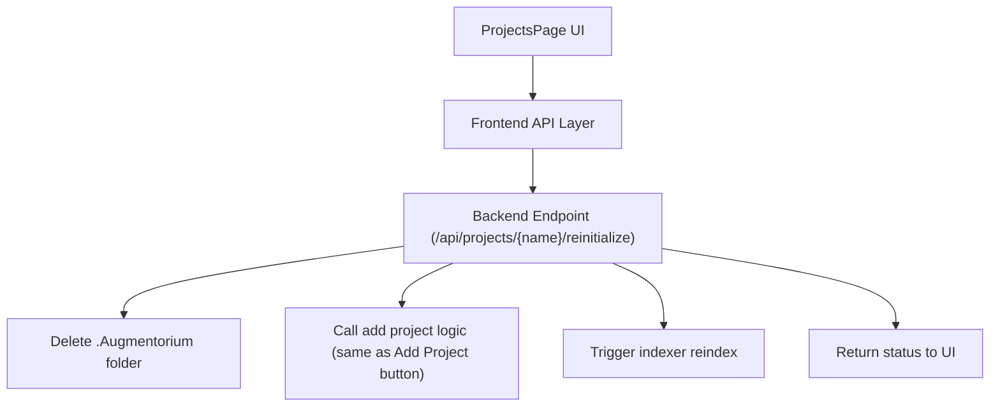

# Plan: Add "Reinitialize" Button to Projects Page

## Objective

Add a "Reinitialize" button to the Projects page. When pressed, it will:
- Delete the entire `.Augmentorium` folder and all its contents in the selected project.
- Recreate the `.Augmentorium` folder and all required subfolders/files, including the "soldier" and graph database, as if the project was being added for the first time.
- Trigger the indexer to re-index the project.

---

## Implementation Plan

### 1. Backend

- **Endpoint:** `/api/projects/<project_name>/reinitialize` in `server/api/api_projects.py`.
- **Steps:**
    1. Look up the project path by name.
    2. Delete the entire `.Augmentorium` folder and all its contents (using `shutil.rmtree`).
    3. Call the same logic as the "Add Project" button to recreate `.Augmentorium`, the "soldier", and the graph database.
    4. Trigger the indexer to re-index the project (as in the current reindex endpoint).
    5. Return a success or error message.

### 2. Frontend

- **API:** Add a new function `reinitializeProject` in `frontend/src/api/projects.ts` to call the new backend endpoint.
- **UI:** In `frontend/src/components/ProjectList.tsx`, add a "Reinitialize" button for each project.
- **Behavior:** On click, confirm with the user, then call the API and show a success/failure alert. Optionally, show a loading spinner while the operation is in progress.

---

## Flow Diagram

---

## Summary

- The UI triggers the frontend API.
- The frontend API calls the backend endpoint.
- The backend deletes `.Augmentorium`, then uses the same logic as "Add Project" to reinitialize, and triggers the indexer.
- Status is returned to the UI.

---

**Note:**  
All backend logic and documentation should use `.Augmentorium` (capital "A") to match your project structure.