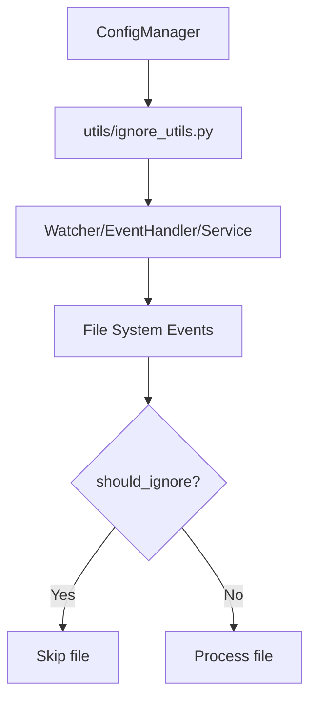

# Plan: Centralize Ignore Logic in Utility Module

## Objective
Create a single utility module for ignore logic, ensuring all indexer components use a consistent, config-driven approach to file ignoring.

---

## 1. Utility Module Design (`utils/ignore_utils.py`)

### Responsibilities
- Load ignore patterns from `config.yaml` and project-specific ignore files.
- Provide a function to return a compiled `pathspec.PathSpec` object for a project.
- Provide a function to check if a path should be ignored, given a project path and config.

### API Sketch

```python
# utils/ignore_utils.py

import pathspec
from typing import List, Optional
import os
from config.manager import ConfigManager

def load_ignore_patterns(config_manager: ConfigManager, project_path: str) -> List[str]:
    # Load base patterns from config.yaml
    base_patterns = config_manager.config.get("indexer", {}).get("ignore_patterns", [])
    # Load project-specific patterns
    project_ignore_file = config_manager.get_project_ignore_file_path(project_path)
    project_patterns = []
    if os.path.exists(project_ignore_file):
        with open(project_ignore_file, 'r') as f:
            for line in f:
                line = line.strip()
                if line and not line.startswith('#'):
                    project_patterns.append(line)
    # Combine and deduplicate
    return list(set(base_patterns + project_patterns))

def get_ignore_spec(config_manager: ConfigManager, project_path: str) -> pathspec.PathSpec:
    patterns = load_ignore_patterns(config_manager, project_path)
    return pathspec.PathSpec.from_lines("gitwildmatch", patterns)

def should_ignore(path: str, project_path: str, ignore_spec: pathspec.PathSpec) -> bool:
    # Compute relative path and check against ignore_spec
    from utils.path_utils import get_relative_path
    rel_path = get_relative_path(path, project_path)
    return ignore_spec.match_file(rel_path)
```

---

## 2. Refactor Integration Points

- **indexer/watcher.py**: Replace local ignore_spec and _should_exclude with calls to `utils/ignore_utils`.
- **indexer/watcher_service.py**: Use the utility to get ignore_spec for scanning and event handling.
- **indexer/event_handler.py**: Use the utility for ignore logic.
- **indexer/project_watcher.py**: Use the utility for ignore logic.

---

## 3. Usage Example

```python
from utils.ignore_utils import get_ignore_spec, should_ignore

ignore_spec = get_ignore_spec(config_manager, project_path)
if should_ignore(file_path, project_path, ignore_spec):
    # Skip file
    pass
```

---

## 4. Testing

- Add or update tests to ensure files matching ignore patterns are always ignored.
- Test with both config.yaml and project-specific ignore files.

---

## 5. Migration

- Remove duplicate ignore logic from all modules.
- Ensure all watchers and event handlers use the utility.

---

## Mermaid Diagram



---

## Next Steps

1. Implement `utils/ignore_utils.py` as described.
2. Refactor all indexer modules to use the utility.
3. Test and verify correct ignore behavior.