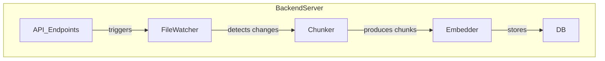

# Plan: Integrating Indexer Functionality Directly into the Backend Server

## 1. Overview

Instead of running the indexer as a separate process or service, all its functions (file watching, chunking, embedding, etc.) would be implemented as part of the backend server (e.g., Flask app). This means a single process handles both API requests and all indexing operations.

---

## 2. Main Indexer Functions

- File system watching (detecting changes in project files)
- Chunking and parsing files
- Embedding and storing data
- Handling ignore logic and project mapping

---

## 3. Pros and Cons

### Pros

- **Simpler Deployment:** Only one process to manage, easier for users to start/stop.
- **No IPC Needed:** Direct function calls instead of inter-process communication.
- **Unified Logging and State:** Easier to track and debug issues.

### Cons

- **Resource Contention:** Indexing tasks may block or slow down API responses if not carefully managed (especially with CPU/GPU-bound embedding).
- **Error Isolation:** Crashes or bugs in indexing could bring down the whole server.
- **Scaling:** Harder to scale indexing and API separately (e.g., can't run multiple indexers for heavy workloads).
- **Threading/Async Complexity:** Need to ensure file watching and indexing run in background threads or async tasks, not blocking the main server thread.

---

## 4. Architectural Implications

- Use background threads, async tasks, or a task queue (e.g., Celery) within the server to handle indexing.
- Carefully manage shared state and thread safety.
- Ensure long-running or blocking tasks do not impact API responsiveness.
- Consider using a supervisor or watchdog to restart the server if critical errors occur.

---

## 5. Migration Steps

1. Move all indexer modules (watcher_service, project_watcher, chunker, etc.) into the backend server codebase.
2. Refactor API endpoints to call these functions directly.
3. Set up background workers/threads for file watching and indexing.
4. Remove any IPC or subprocess logic.
5. Update documentation and deployment scripts.

---

## 6. Mermaid Diagram: Integrated Architecture

---

## 7. Recommendations

- For small to medium projects, this approach can greatly simplify deployment and maintenance.
- For large-scale or high-availability systems, consider the trade-offs in error isolation and scalability.
- Use robust background task management to avoid blocking the main server.

---

**Would you like to proceed with this plan, or discuss further adjustments?**