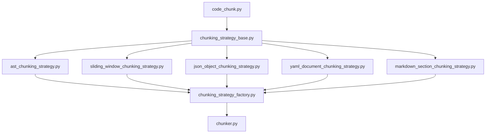

# Refactoring Plan: `indexer/chunker.py`

## Current Structure

The file `indexer/chunker.py` is 787 lines long and contains the following main classes:

- **CodeChunk**: Representation of a code chunk for embedding
- **ChunkingStrategy**: Base class for chunking strategies
- **ASTChunkingStrategy**: Chunking strategy based on AST
- **SlidingWindowChunkingStrategy**: Chunking strategy based on sliding window
- **JsonObjectChunkingStrategy**: Chunking strategy for JSON files
- **YamlDocumentChunkingStrategy**: Chunking strategy for YAML files
- **MarkdownSectionChunkingStrategy**: Chunking strategy for Markdown files
- **ChunkingStrategyFactory**: Factory for creating chunking strategies
- **Chunker**: Main chunker for code files

## Observations

- Each strategy is a distinct class with a clear responsibility.
- The file combines data structures, base classes, multiple strategies, a factory, and the main orchestrator.
- There is a clear opportunity to split the file into smaller, focused modules.

## Proposed Modular Breakdown

### 1. `code_chunk.py`
- Contains the `CodeChunk` class.

### 2. `chunking_strategy_base.py`
- Contains the `ChunkingStrategy` base class.

### 3. `ast_chunking_strategy.py`
- Contains the `ASTChunkingStrategy` class.

### 4. `sliding_window_chunking_strategy.py`
- Contains the `SlidingWindowChunkingStrategy` class.

### 5. `json_object_chunking_strategy.py`
- Contains the `JsonObjectChunkingStrategy` class.

### 6. `yaml_document_chunking_strategy.py`
- Contains the `YamlDocumentChunkingStrategy` class.

### 7. `markdown_section_chunking_strategy.py`
- Contains the `MarkdownSectionChunkingStrategy` class.

### 8. `chunking_strategy_factory.py`
- Contains the `ChunkingStrategyFactory` class.

### 9. `chunker.py`
- Contains the `Chunker` class.
- Add a note at the top indicating the file has been modularized and is pending removal after migration is validated.

## Refactoring Steps

1. **Create New Modules**
   - Move each class to its own file as outlined above.
   - Ensure each file has the necessary imports and docstrings.

2. **Update Imports**
   - Update all references in the codebase to import these classes from their new modules.

3. **Test Functionality**
   - Run existing tests (or create new ones) to ensure chunking functionality is preserved.

4. **Documentation**
   - Update or create documentation to reflect the new module structure.

## Mermaid Diagram: Refactored Structure

## Benefits

- **Improved Maintainability**: Each module has a single responsibility, making it easier to understand and modify.
- **Easier Testing**: Smaller modules are easier to test in isolation.
- **Scalability**: New chunking strategies can be added without bloating a single file.

---

Would you like to proceed with this plan, or make any adjustments? If you approve, I can orchestrate the implementation as the next step.