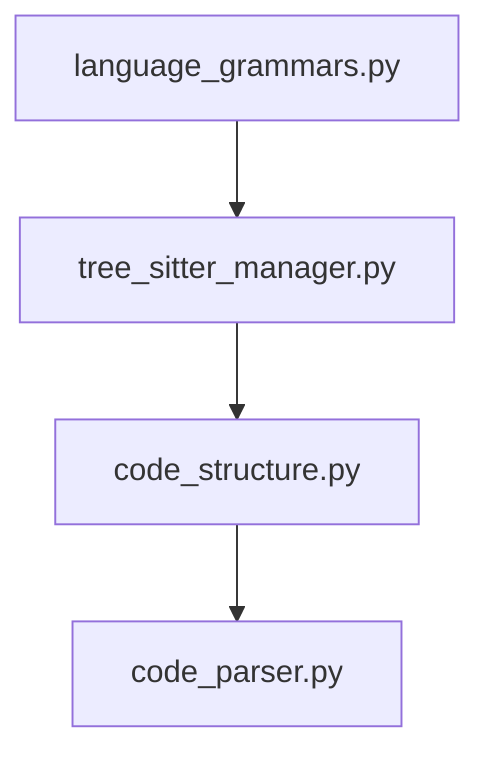

# Refactoring Plan: `indexer/parser.py`

## Current Structure

The file `indexer/parser.py` is 701 lines long and contains the following main classes and components:

- **LANGUAGE_GRAMMARS**: Mapping of language names to Tree-sitter grammars
- **TreeSitterManager**: Manages Tree-sitter languages and parsers
- **CodeStructure**: Representation of code structure (nodes, classes, functions, etc.)
- **CodeParser**: Main parser for code files, orchestrates parsing and structure extraction

## Observations

- The file combines language grammar mappings, Tree-sitter management, code structure representation, and the main parsing logic.
- Each class has a distinct responsibility and can be modularized for clarity and maintainability.

## Proposed Modular Breakdown

### 1. `language_grammars.py`
- Contains the `LANGUAGE_GRAMMARS` mapping and any related constants.

### 2. `tree_sitter_manager.py`
- Contains the `TreeSitterManager` class.

### 3. `code_structure.py`
- Contains the `CodeStructure` class.

### 4. `code_parser.py`
- Contains the `CodeParser` class.

## Refactoring Steps

1. **Create New Modules**
   - Move each class or mapping to its own file as outlined above.
   - Ensure each file has the necessary imports and docstrings.

2. **Update Imports**
   - Update all references in the codebase to import these classes or mappings from their new modules.

3. **Test Functionality**
   - Run existing tests (or create new ones) to ensure parsing and code structure extraction functionality is preserved.

4. **Documentation**
   - Update or create documentation to reflect the new module structure.

5. **Deprecate parser.py**
   - Add a note at the top of the original `parser.py` indicating it has been modularized and is pending removal after migration is validated.

## Mermaid Diagram: Refactored Structure

## Benefits

- **Improved Maintainability**: Each module has a single responsibility, making it easier to understand and modify.
- **Easier Testing**: Smaller modules are easier to test in isolation.
- **Scalability**: New parsing features or language support can be added without bloating a single file.

---

Would you like to proceed with this plan, or make any adjustments? If you approve, I can orchestrate the implementation as the next step.