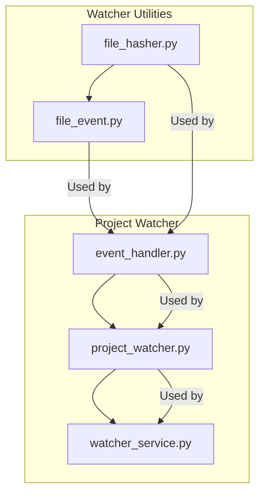

# Refactoring Plan: `indexer/watcher.py`

## Current Structure

The file `indexer/watcher.py` is 646 lines long and contains the following main classes:

- **FileHasher**: Utility for tracking file changes via hashing (lines 27–157)
- **FileEvent**: Data structure for file events (lines 160–187)
- **ProjectEventHandler**: Handles file system events for a project (lines 190–322)
- **ProjectWatcher**: Watches a single project for file changes (lines 325–393)
- **FileWatcherService**: Manages watching multiple projects (lines 396–646)

## Observations

- Each class has a distinct responsibility.
- The file combines low-level utilities (hashing), event data structures, event handling, and high-level service orchestration.
- There is a clear opportunity to split the file into smaller, focused modules.

## Proposed Modular Breakdown

### 1. `file_hasher.py`
- Contains the `FileHasher` class.
- Responsibility: File hashing and hash cache management.

### 2. `file_event.py`
- Contains the `FileEvent` class.
- Responsibility: Data structure for file system events.

### 3. `event_handler.py`
- Contains the `ProjectEventHandler` class.
- Responsibility: Handles file system events for a single project.

### 4. `project_watcher.py`
- Contains the `ProjectWatcher` class.
- Responsibility: Watches a single project, manages event handler and observer.

### 5. `watcher_service.py`
- Contains the `FileWatcherService` class.
- Responsibility: Orchestrates watching multiple projects, manages event queues and service lifecycle.

## Refactoring Steps

1. **Create New Modules**
   - Move each class to its own file as outlined above.
   - Ensure each file has the necessary imports and docstrings.

2. **Update Imports**
   - Update all references in the codebase to import these classes from their new modules.

3. **Test Functionality**
   - Run existing tests (or create new ones) to ensure watcher functionality is preserved.
   - Validate that file watching, event handling, and hash caching work as expected.

4. **Documentation**
   - Update or create documentation to reflect the new module structure.

## Mermaid Diagram: Refactored Structure

## Benefits

- **Improved Maintainability**: Each module has a single responsibility, making it easier to understand and modify.
- **Easier Testing**: Smaller modules are easier to test in isolation.
- **Scalability**: New watcher features or event types can be added without bloating a single file.

---

Would you like to proceed with this plan, or make any adjustments? If you approve, I can suggest the next steps for implementation or write this plan to a markdown file in your project.